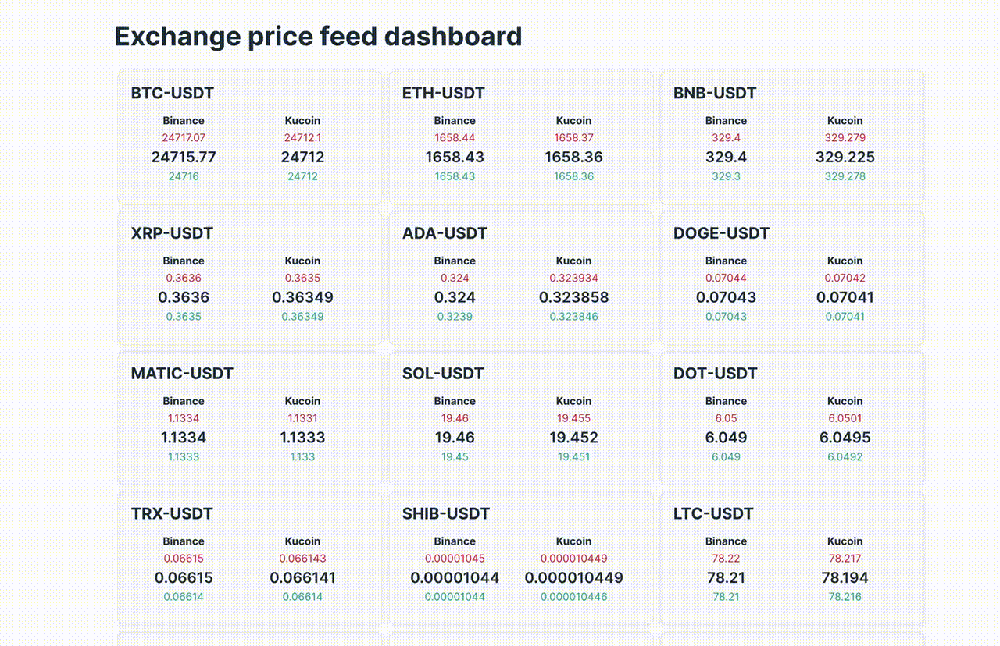

# market-tick-dashboard

Crypto market tick dashboard. Displays real-time tick price across two exchanges with a configurable list of tokens.



## Backend

- Run Go backend
```bash
cd backend
go run main.go
```
- Need to have Redis setup:
```bash
# from project root
docker-compose up
```

## Frontend

- Run Next.js dashboard
```bash
cd app
npm install
npm run dev
```

## Specification

- Symbol style example: BTC-USDT (originally on Binance: BTCUSDT, Kucoin: BTC-USDT)
